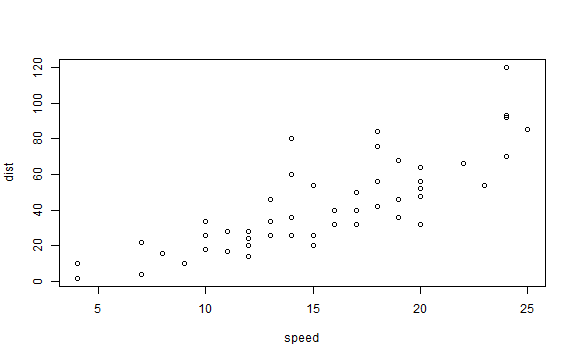

## Introduction

[Slidify](slidify.org) is an R package which makes it easy to generate cusomized HTML content from a simple RMarkdown file.  The sure can specify custom templates and 


This is where I test out new slidify layouts!

---
## An example plot

Using the `cars` data in R


```r
plot(dist ~ speed, data = cars)
```



---
## An example table using `knitr`


```r
knitr::kable(head(cars), format = "markdown")
```


| speed| dist|
|-----:|----:|
|     4|    2|
|     4|   10|
|     7|    4|
|     7|   22|
|     8|   16|
|     9|   10|

---
## Some example R output


```r
fit1 <- lm(dist ~ speed, data = cars)
summary(fit1)
```

```
#> 
#> Call:
#> lm(formula = dist ~ speed, data = cars)
#> 
#> Residuals:
#>    Min     1Q Median     3Q    Max 
#> -29.07  -9.53  -2.27   9.21  43.20 
#> 
#> Coefficients:
#>             Estimate Std. Error t value Pr(>|t|)
#> (Intercept)  -17.579      6.758   -2.60    0.012
#> speed          3.932      0.416    9.46  1.5e-12
#> 
#> Residual standard error: 15.4 on 48 degrees of freedom
#> Multiple R-squared:  0.651,	Adjusted R-squared:  0.644 
#> F-statistic: 89.6 on 1 and 48 DF,  p-value: 1.49e-12
```

